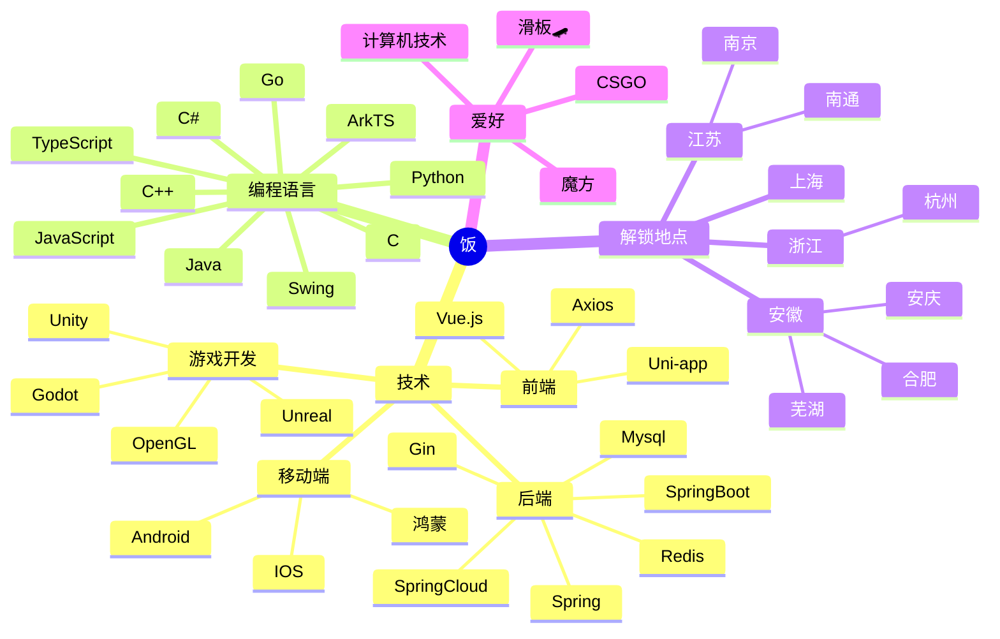

## Hi there 👋

<!--
**xing-ya-668/xing-ya-668** is a ✨ _special_ ✨ repository because its `README.md` (this file) appears on your GitHub profile.

Here are some ideas to get you started:

- 🔭 I’m currently working on ...
- 🌱 I’m currently learning ...
- 👯 I’m looking to collaborate on ...
- 🤔 I’m looking for help with ...
- 💬 Ask me about ...
- 📫 How to reach me: ...
- 😄 Pronouns: ...
- ⚡ Fun fact: ...
-->


<div align="center">  </div>


————————————————————————


<div align="center">
  <div align="center">
    
  </div>


  <!-- dynamic typing effect 动态打字效果 -->
  <div align="center">
    <a href="https://eatfans.github.io/"> 
      
    </a>
  </div>

  <!-- knock code pictures 敲代码的图片 -->
  <br>

  <!-- profile logo 个人资料徽标 -->
  <div align="center">
    <a href="https://eatfans.github.io/"></a>&emsp;
    <a href="https://twitter.com/eatfan"></a>&emsp;
    <a href="https://space.bilibili.com/448488855/"></a>&emsp;
    <a href="https://blog.csdn.net/weixin_50915462/"></a>&emsp;
    <!-- visitor statistics logo 访问量统计徽标 -->
    
  </div>

<!-- Snake Code Contribution Map 贪吃蛇代码贡献图 -->
<picture>
  <source media="(prefers-color-scheme: dark)" srcset="https://cdn.jsdelivr.net/gh/sun0225SUN/sun0225SUN/profile-snake-contrib/github-contribution-grid-snake-dark.svg" />
  <source media="(prefers-color-scheme: light)" srcset="https://cdn.jsdelivr.net/gh/sun0225SUN/sun0225SUN/profile-snake-contrib/github-contribution-grid-snake.svg" />
  
</picture>

</div>

#  🙋 Hello

<table>
<tr><td>

<!-- About me 关于我 -->
### 🤺 About Me


<p>&emsp;&emsp;你好啊！我是EatFan，你可以叫我“饭”。</p>
<p>&emsp;&emsp;喜欢开发！喜欢滑板！喜欢自由！</p>
<p>&emsp;&emsp;热爱计算机科学和IT互联网事业，励志成为一名优秀的全栈开发者。</p>
<p>&emsp;&emsp;我们正在让这个世界变得更加美好，通过代码的重复使用和延展构建完美体系。</p>
<p><strong>&emsp;&emsp;We're making the world a better place. Through constructing elegant hierarchies for maximum code reuse and extensibility.</strong></p>

</td></tr>

<tr>
<td>


<!-- 近期博客 -->
### 📃 Recent Blog
  


<!-- START_SECTION:blog -->
* <a href='https://eatfans.github.io' target='_blank'>奔跑在自己的时区里，你好哇，我的17岁！</a> - 2023-02-25
<!-- END_SECTION:blog -->

</td></tr>


<tr><td>

<!-- wakatime 统计 -->
### 📊 Most used languages

<div align="center"> 
   
</div>

</td></tr>

<tr><td>

<div align="center" >
<!--  skill badge 技能徽章 -->
  


<!-- programming tool icon 编程工具图标 -->
<h3>展示台</h3>


<br>

<br>

<br>

<br>

<br>

<!-- svg -->


 


<br>

<!-- gif -->


<!-- just img 图片 -->
</div>


</div>

<!-- ########################################## 分割 ########################################## -->


<div align="center" >



<!--START_SECTION:waka-->
**I'm an Early 🐤** 

```text
🌞 Morning                364 commits         █████░░░░░░░░░░░░░░░░░░░░   21.60 % 
🌆 Daytime                521 commits         ████████░░░░░░░░░░░░░░░░░   30.92 % 
🌃 Evening                537 commits         ████████░░░░░░░░░░░░░░░░░   31.87 % 
🌙 Night                  263 commits         ████░░░░░░░░░░░░░░░░░░░░░   15.61 % 
```
📅 **I'm Most Productive on Friday** 

```text
Monday                   223 commits         ███░░░░░░░░░░░░░░░░░░░░░░   13.23 % 
Tuesday                  196 commits         ███░░░░░░░░░░░░░░░░░░░░░░   11.63 % 
Wednesday                216 commits         ███░░░░░░░░░░░░░░░░░░░░░░   12.82 % 
Thursday                 202 commits         ███░░░░░░░░░░░░░░░░░░░░░░   11.99 % 
Friday                   457 commits         ███████░░░░░░░░░░░░░░░░░░   27.12 % 
Saturday                 159 commits         ██░░░░░░░░░░░░░░░░░░░░░░░   09.44 % 
Sunday                   232 commits         ███░░░░░░░░░░░░░░░░░░░░░░   13.77 % 
```


📊 **This Week I Spent My Time On** 

```text
🕑︎ Time Zone: Asia/Shanghai

💬 Programming Languages: 
Vue.js                   17 hrs 59 mins      ██████████████████████░░░   86.17 % 
JavaScript               1 hr 34 mins        ██░░░░░░░░░░░░░░░░░░░░░░░   07.56 % 
JSON                     29 mins             █░░░░░░░░░░░░░░░░░░░░░░░░   02.37 % 
TypeScript               22 mins             ░░░░░░░░░░░░░░░░░░░░░░░░░   01.79 % 
SCSS                     15 mins             ░░░░░░░░░░░░░░░░░░░░░░░░░   01.24 % 

🔥 Editors: 
VS Code                  20 hrs 7 mins       ████████████████████████░   96.40 % 
IntelliJ                 45 mins             █░░░░░░░░░░░░░░░░░░░░░░░░   03.60 % 

💻 Operating System: 
Windows                  20 hrs 52 mins      █████████████████████████   100.00 % 
```


 Last Updated on 14/10/2023 01:11:15 UTC
<!--END_SECTION:waka-->
  
</td></tr>
</table>


<div align="center" >
<!-- just img 图片 -->

</div>


<!-- ########################################## 分割 ########################################## -->


<div align="center" >
  
<!-- Quotes 名人名言 -->
<br>
  
<!-- GitHub 奖杯🏆 -->
<br>

<!-- GitHub 数据统计 -->

<br><br>

<!-- Awesome repo 比较好的仓库-->
<!-- 仓库展示
<a href="https://github.com/sun0225SUN/Awesome-Love-Code">
</a>
<a href="https://github.com/sun0225SUN/Student-Data-Vision">
</a><br><br>
-->

<!-- ########################################## 分割 ########################################## -->


<div align="center">

<!-- run 图片 -->


<!-- GitHub Activity Graph GitHub 活动图 -->
<table align="center">
  <tr>
    <td></td>
  </tr>
</table>

</div>

<!-- ########################################## 分割 ########################################## -->


<!-- GitHub metrics 信息指标 -->
<div align="center"> </div>


